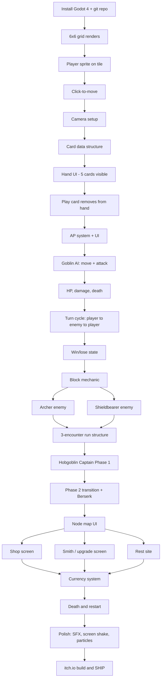

# Tactical Deckbuilder Roguelike — Working Design Doc

> One-page-ish design doc + build tracker. Living document. Edit freely.

---

## 1. One-Line Pitch

A grid-based tactical roguelike deckbuilder where positioning and a per-turn action-point economy turn every card play into a tactical decision. Slay the Spire's run structure, Divinity's AP economy, D&D flavor.

## 2. Stack & Platform

- **Engine:** Godot 4
- **Target:** Desktop (Windows/Mac/Linux), shipped via itch.io
- **Repo:** GitHub, public, committed to daily during build
- **NOT v1:** mobile, console, web

## 3. Core Loop

1. Start a run with the 10-card Fighter starter deck and 50 HP
2. Move through 3 combat encounters on a node-map
3. Between fights: shop (buy cards), smith (upgrade cards), rest (heal)
4. Defeat the Hobgoblin Captain
5. Win → unlock 1 new card for future runs. Die → start over.

## 4. Combat Rules

- **Grid:** 6×6 square tiles
- **Player AP:** 3 per turn (unspent AP discarded)
- **Player HP:** 50, persists between fights, restored only at rest sites
- **Block:** Resets at start of player turn (Slay the Spire-style)
- **Hand:** Draw 5/turn, discard remaining at turn end, reshuffle when deck empty
- **Movement:** Standalone action. Click character to enter movement mode, click a destination tile to walk there. **1 AP per tile traversed.** Path auto-routes around obstacles. Cards that grant movement are independent of this system.

## 5. Starter Deck (10 cards — Fighter)

| Count | Card | Cost | Effect |
|---|---|---|---|
| 4 | Strike | 1 AP | 6 damage to adjacent enemy |
| 3 | Defend | 1 AP | Gain 5 block |
| 1 | Shove | 1 AP | 4 damage + push enemy 1 tile |
| 1 | Cleave | 2 AP | 4 damage to all adjacent enemies |
| 1 | Charge | 2 AP | Move up to 3 tiles in a straight line, then attack adjacent for 6 |

## 6. Enemy Roster (v1)

| Enemy | HP | AP | Behavior |
|---|---|---|---|
| Goblin (Aggressor) | 8 | 3 | Moves toward nearest player tile, attacks adjacent for 4 |
| Archer (Kiter) | 6 | 4 | If adjacent to player: moves to max range first, then shoots for 3 (range 4). Otherwise shoots. |
| Shieldbearer (Tank) | 14 | 2 | Advances 1 tile/turn, attacks adjacent for 5. Every other turn: Brace (50% damage reduction next turn). |

**Information shown to player:** HP, AP per turn, movement range on tap, attack range on tap. **No** explicit next-action telegraphs. Behavior must be learnable from observation.

## 7. Boss: Hobgoblin Captain

**Stats:** 50 HP, 5 AP/turn

**Phase 1 (HP 50 → 26):**
- *Throwing Axe* (2 AP): ranged, range 4, 5 damage
- *Cleaving Strike* (3 AP): 6 damage in 3-tile arc to front
- *Rally* (2 AP): 4 block + "next attack +3 damage"

**Phase 2 (HP 25 → 0, "Berserk"):**
- Drops throwing axe (no more ranged)
- Passive: +2 damage dealt, +2 damage taken
- *Reckless Charge* (4 AP): moves up to 4 tiles in a straight line, deals 7 damage to anyone in the lane

## 8. Map & Meta

- **Node-map** (Slay the Spire structure), illustrated as a hand-drawn dungeon map
- **Node types:** combat, shop, smith, rest, boss (no elites in v1)
- **Flavor text on hover** sets the "place feel" without needing actual exploration
- **Currency:** gold drops from enemies, spent at shops

## 9. Explicitly Out of Scope for v1

- Multiple character classes (architecture not designed for them — refactor later)
- Free exploration / out-of-combat character controller
- Meta-progression / cross-run unlocks (except 1 unlock card on win)
- Save/load mid-run
- Mobile port
- Status effects (poison, burn, stun)
- Card upgrade trees (single upgrade tier only)
- Story / narrative beyond flavor text
- More than 1 boss
- Co-op / multiplayer

## 10. v2 Parking Lot (do not build now — write here when ideas appear)

- Rogue and Mage classes
- Grid-aware block cards ("+block adjacent to terrain")
- Stealth/cover system
- Multiple acts/biomes
- Free-exploration dungeon mode
- trinket items that give passive buffs
- DOT effects
- Weapons and armor

## 11. Pixel Art Specifications
 
- **Resolution:** 24x24 or 32x32 character sprites. Test both before committing. **16x16 tilemap.**
- **Software:** Aseprite ($20). Layer support is required for weapon-on-character overlay.
- **Perspective:** Front-facing isometric. 2 directions only — SE and SW. No NW/NE back views.
- **Asymmetric character handling:** Hand-drawn both directions. No mirror-flip. The right-side undercut, blue streak, sword (right hand), and shield (left hand) stay anatomically consistent.
- **Palette:** Cap at ~16–24 colors per character. Lock a master palette before drawing any frame past the first character. Adding colors later means repainting everything for consistency.
- **Frame rate (varies by animation):**
  - Idle: 4–6 FPS
  - Move: 8–10 FPS
  - Attack: 12–18 FPS, with the impact frame held 100–150ms regardless
  - Block / take damage / die: 8–12 FPS
- **Native screen resolution:** Pick a value that scales cleanly to 1920×1080. Recommended: 480×270 (4× scale) or 640×360 (3× scale).
- **Equipment layers:** Body, armor/clothing, weapon, shield as separate Aseprite layers. Enables future equipment swaps without redrawing everything.
## 12. Animation Manifest
 
> Per character, per direction. Total frames = listed frames × 2 (for SE and SW). Numbers are targets, not maximums — fewer is fine if the animation reads.
 
### 12.1 Main Character (Fighter)
 
| Animation | Trigger | Frames | Notes |
|---|---|---|---|
| Idle | Default state | 2–4 | Subtle breathing/sway. Held long. |
| Move | Tile-to-tile traversal | 4–6 | Walk cycle. Contact + passing + contact + passing. |
| Attack 1 — Strike | Strike card | 4–6 | Windup → impact (held) → recovery |
| Attack 2 — Cleave | Cleave card | 5–7 | Wider arc, visually swings across multiple tiles |
| Attack 3 — Shove | Shove card | 3–5 | Shield-bash forward. Snappier than sword attacks. |
| Block | Defend card | 2–3 | Shield raised, hold pose |
| Take damage | Incoming damage | 2–3 | Brief recoil/flinch, return to idle |
| Die | HP reaches 0 | 4–6 | Stagger and collapse, ends on a static "dead" frame |
| Victory | End-of-combat | 2–3 | Optional but cheap. Sells the moment. |
 
**Reused for Charge card:** Move animation + Attack 1 stitched in code. No new art required.
 
**Estimated total:** ~9 animations × 2 directions × ~4.5 avg frames = **~80 frames**.
 
### 12.2 Goblin (Aggressor)
 
| Animation | Frames | Notes |
|---|---|---|
| Idle | 2 | Minimal — twitchy, snarling |
| Move | 4 | Quick, aggressive lope |
| Attack | 4–5 | Crude swing, low windup |
| Take damage | 2 | |
| Die | 4 | |
 
**Estimated total:** 5 anims × 2 dirs × ~3.4 avg frames = **~34 frames**.
 
### 12.3 Archer (Kiter)
 
| Animation | Frames | Notes |
|---|---|---|
| Idle | 2 | Bow at rest |
| Move | 4 | |
| Attack (draw + shoot) | 5–6 | Draw bow (held), release, recovery |
| Take damage | 2 | |
| Die | 4 | |
 
**Additional asset:** Arrow projectile sprite (1–2 frames, flying + impact). Separate from character sheet.
 
**Estimated total:** 5 anims × 2 dirs × ~3.6 avg frames + projectile = **~38 frames**.
 
### 12.4 Shieldbearer (Tank)
 
| Animation | Frames | Notes |
|---|---|---|
| Idle | 2 | Heavy, planted stance |
| Move | 4–6 | Slow, deliberate |
| Attack | 4–5 | |
| Brace | 3 | Defensive pose, every-other-turn ability. Distinct silhouette from Block. |
| Take damage | 2 | |
| Die | 4 | |
 
**Estimated total:** 6 anims × 2 dirs × ~3.7 avg frames = **~44 frames**.
 
### 12.5 Hobgoblin Captain (Boss)
 
Boss carries the most weight in player memory. Do not skimp on these.
 
**Phase 1 (HP 50 → 26):**
 
| Animation | Frames | Notes |
|---|---|---|
| Idle (P1) | 3 | Confident, armored, axe visible |
| Move | 5 | Heavy, intentional steps |
| Throwing Axe | 6–8 | Big windup, throw, recovery. Sells the ranged threat. |
| Cleaving Strike | 6–8 | 3-tile arc swing, hold impact frame |
| Rally | 4 | Defensive pose, particle/flash effect for buff |
| Take damage (P1) | 2 | |
 
**Phase transition:**
 
| Animation | Frames | Notes |
|---|---|---|
| Phase 2 transition | 6–10 | Drops axe (visible on ground after), berserker pose, screen-shake worthy. One-shot, not looped. |
 
**Phase 2 (HP 25 → 0, Berserk):**
 
| Animation | Frames | Notes |
|---|---|---|
| Idle (P2) | 3 | Visibly distinct from P1 — heavier breathing, no axe, more menacing |
| Move (P2) | 5 | Faster, looser than P1 move |
| Reckless Charge | 7–9 | Dramatic windup → 4-tile dash → impact. The signature P2 attack. |
| Take damage (P2) | 2 | |
| Die | 6–8 | Boss death deserves the most frames in the entire game |
 
**Estimated total:** 11 anims × 2 dirs × ~5.2 avg frames = **~115 frames**.
 
### 12.6 Tilemap & Environment Assets (16×16)
 
| Asset | Variations | Notes |
|---|---|---|
| Floor tile (combat) | 3–4 | Slight pattern variance to avoid obvious tiling |
| Floor tile edge / border | 2 | Where the grid meets the void |
| Wall / impassable | 2 | If you add obstacles in v1; skip otherwise |
| Tile highlight (moveable) | 1 | UI overlay, semi-transparent |
| Tile highlight (attackable) | 1 | UI overlay, different color |
| Boss arena floor | 3–4 | Visually distinct from regular combat tiles |
 
### 12.7 Effects & UI (variable resolution)
 
| Asset | Notes |
|---|---|
| Sword slash | 2–3 frames, 32×32 or larger, overlay on attack |
| Shield-block flash | 2 frames, brief |
| Damage number popups | Font + animated rise/fade |
| Block-icon (UI) | Static, small |
| AP-pip (UI) | Static, small |
| Card art | Out of scope — placeholder text-only cards for v1 ship. Add art in v1.1. |
 
### 12.8 Total Frame Estimate
 
| Asset group | Frames |
|---|---|
| Player | ~80 |
| Goblin | ~34 |
| Archer | ~38 + projectile |
| Shieldbearer | ~44 |
| Boss | ~115 |
| Tiles | ~15 |
| Effects/UI | ~20 |
| **Total** | **~350 frames** |
 
> At 24x24 with intermediate skill: ~15–25 min/frame = **90–145 hours**. At 32x32: ~25–40 min/frame = **145–230 hours**. Solo, part-time, this is the bulk of weeks 11–14.
 
---
 
## Triage Order (If Weeks 11–14 Slip)
 
If you run out of time, ship in this priority order. Anything below the cut-line stays placeholder for v1.0 and gets done as v1.1.
 
1. **Player character** — all animations, both directions
2. **Hobgoblin Captain (Boss)** — all animations, both phases
3. **Tilemap** — at least combat floor + highlights
4. **Effects** — sword slash, shield flash
5. **Goblin** — most common enemy, highest visibility
6. **Shieldbearer** — distinct silhouette helps tactical reading
7. **Archer** — last priority; ranged enemy reads as "the one with the bow" even at placeholder fidelity
8. **Victory pose, idle variations, polish frames** — strictly nice-to-have
> The cut-line lives somewhere around #5 for a realistic solo ship. Decide before week 11 whether enemies stay as placeholder at launch and are added in v1.1, or whether the ship date moves.
 
---

# Build Dependency Tree

---

# Weekly Checklist

> Don't dwell on weeks. Move the work forward — these are guideposts, not deadlines. If you're a week ahead, great. A week behind, cut scope.

### Week 1 — Foundation
- [x] Godot 4 installed, hello world running
- [x] Public GitHub repo created and pushed
- [x] 6×6 grid renders on screen
- [x] Player sprite placed on a tile (placeholder art is fine)

### Week 2 — Movement & Setup
- [x] Click-to-move working (player moves to clicked tile)
- [x] Camera framed correctly
- [x] Card data structure defined (just a script/resource, no UI yet)

### Week 3 — Cards & AP
- [ ] Hand UI: 5 cards visible, drawable from a deck
- [ ] Click a card to "play" it (just log to console for now)
- [ ] AP system: 3 AP per turn, costs deducted on play
- [ ] End turn button

### Week 4 — First Combat
- [ ] Goblin enemy with basic AI (move toward player, attack adjacent)
- [ ] HP system for player and enemies
- [ ] Damage from Strike works
- [ ] Enemies die and disappear
- [ ] Win/lose detection (all enemies dead = win, player HP 0 = lose)

### Week 5 — Defense & Polish Combat
- [ ] Block mechanic (Defend card works, resets each turn)
- [ ] Archer enemy
- [ ] Shieldbearer enemy + brace logic
- [ ] All 10 starter deck cards work (Cleave, Shove, Charge)

### Week 6 — Run Loop
- [ ] 3 combat encounters chain together
- [ ] HP persists between fights
- [ ] Game-over screen on death

### Week 7 — Boss Phase 1
- [ ] Hobgoblin Captain enemy with all 3 phase-1 abilities
- [ ] Boss-specific encounter (larger, different visual)

### Week 8 — Boss Phase 2 & Tuning
- [ ] Phase 2 transition at 25 HP
- [ ] Reckless Charge working with lane targeting
- [ ] Playtest, retune damage numbers
- [ ] **First playable run start-to-boss** ← celebrate this

### Week 9 — Meta Layer
- [ ] Node map screen
- [ ] Currency drops from kills
- [ ] Shop screen (buy 1 of 3 random cards for gold)

### Week 10 — Meta Layer Continued
- [ ] Smith screen (upgrade 1 card per visit)
- [ ] Rest site (heal 30% HP)
- [ ] Death → restart loop

### Week 11 — Art Foundations
- [ ] Aseprite installed, configured
- [ ] Native screen resolution locked (480×270 or 640×360)
- [ ] Character resolution locked (24x24 vs 32x32) — sketch one IDLE pose in each, decide which reads better at native scale
- [ ] Master palette locked (~24 colors)
- [ ] Player IDLE SE drawn — this is the keystone frame; every other character sprite must match its style/scale
- [ ] Player IDLE SW drawn — confirms the hand-drawn-both-directions workflow is sustainable
- [ ] Decision: keep this art-pass plan, or revert to placeholders + ship now and art-pass in v1.1?

### Week 12 — Player Character Complete
- [ ] Player Move (both directions)
- [ ] Player Attack 1 — Strike (both directions)
- [ ] Player Attack 2 — Cleave (both directions)
- [ ] Player Attack 3 — Shove (both directions)
- [ ] Player Block (both directions)
- [ ] Player Take Damage (both directions)
- [ ] Player Die (both directions)
- [ ] Integrate all player animations into Godot, replace placeholder, playtest

### Week 13 — Enemies
- [ ] Boss Phase 1 (Idle, Move, all 3 abilities, Take Damage) — both directions
- [ ] Boss Phase Transition
- [ ] Boss Phase 2 (Idle, Move, Reckless Charge, Take Damage, Die) — both directions
- [ ] Integrate boss into Godot, playtest the boss fight
- [ ] **Triage check:** if behind, declare which enemies ship as placeholder for v1.0

### Week 14 — Tiles, Effects, Polish, Ship
- [ ] Goblin animations (if time)
- [ ] Archer animations + arrow projectile (if time)
- [ ] Shieldbearer animations (if time)
- [ ] Tilemap (floor, highlights, boss arena)
- [ ] Effects (sword slash, shield flash)
- [ ] SFX from freesound.org
- [ ] Screen shake on big hits
- [ ] Tutorial messaging (3–4 popup tips)
- [ ] Export to Windows/Mac/Linux
- [ ] itch.io page (screenshots, gif, devlog)
- [ ] **SHIP**
- [ ] Share on r/roguelikedev, r/IndieDev, r/gamedev

---

# Accountability System

> The hardest week is week 5–7 — the dopamine of "new project" has worn off, the spectacle of "shipping" feels far away, the boring middle is here. Pick at least 2 mechanisms below before you start coding. Without them, the math is against you.

### Pick ≥ 2:

- [x] **Weekly public devlog** — post progress every Sunday on: personal blog (Twitter/X, Mastodon, Bluesky, r/roguelikedev, personal blog)
- [x] **GitHub commit streak** — minimum 1 commit per active day, track via GitHub's contribution graph

### My implementation intention (Gollwitzer-style if/then plan):

- **If** it is after Dinner or A day off, **then** I will be at home or at the library with Godot open working on the next checkbox until at most 10 p.m.
- **If** I miss a session, **then** the next session is during my lunch — no negotiating.
- **If** I get stuck for more than 2 hours on a problem, **then** I ask in Godot Discord, Stack Overflow and Claude before grinding solo.

---

# Notes / Decisions Log

> Write here when you make a design change. Date it. Revisit before you let scope creep further.

- 2026-05-20: parked ideas for DOTS, items, and weapons for v2. Reminder: our MVP is of greater scope than most portfolio projects. Finishing > expanding.

- 2026-05-24: committed to custom pixel art over placeholders. 24x24 or 32x32 characters, 16x16 tiles. Aseprite. Front-facing isometric, 2 directions (SE/SW) hand-drawn — chosen to preserve asymmetric character design (undercut, blue streak, right-handed sword) without mirror-flip artifacts. Ship date pushed from week 12 to week 14 to accommodate ~350-frame art pass. Triage order documented for slip scenarios.
