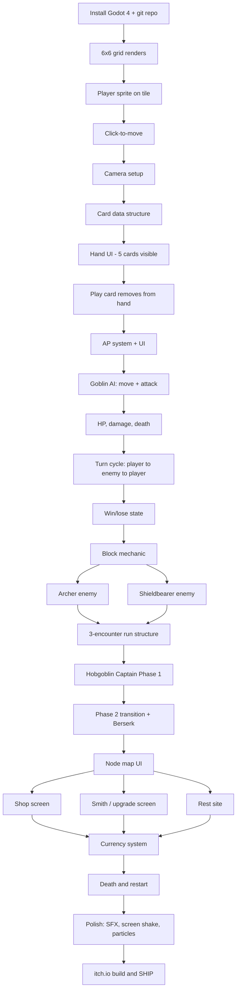

# Tactical Deckbuilder Roguelike — Working Design Doc

> One-page-ish design doc + build tracker. Living document. Edit freely.

---

## 1. One-Line Pitch

A grid-based tactical roguelike deckbuilder where positioning and a per-turn action-point economy turn every card play into a tactical decision. Slay the Spire's run structure, Divinity's AP economy, D&D flavor.

## 2. Stack & Platform

- **Engine:** Godot 4
- **Target:** Desktop (Windows/Mac/Linux), shipped via itch.io
- **Repo:** GitHub, public, committed to daily during build
- **NOT v1:** mobile, console, web

## 3. Core Loop

1. Start a run with the 10-card Fighter starter deck and 50 HP
2. Move through 3 combat encounters on a node-map
3. Between fights: shop (buy cards), smith (upgrade cards), rest (heal)
4. Defeat the Hobgoblin Captain
5. Win → unlock 1 new card for future runs. Die → start over.

## 4. Combat Rules

- **Grid:** 6×6 square tiles
- **Player AP:** 3 per turn (unspent AP discarded)
- **Player HP:** 50, persists between fights, restored only at rest sites
- **Block:** Resets at start of player turn (Slay the Spire-style)
- **Hand:** Draw 5/turn, discard remaining at turn end, reshuffle when deck empty

## 5. Starter Deck (10 cards — Fighter)

| Count | Card | Cost | Effect |
|---|---|---|---|
| 4 | Strike | 1 AP | 6 damage to adjacent enemy |
| 3 | Defend | 1 AP | Gain 5 block |
| 1 | Shove | 1 AP | 4 damage + push enemy 1 tile |
| 1 | Cleave | 2 AP | 4 damage to all adjacent enemies |
| 1 | Charge | 2 AP | Move up to 3 tiles in a straight line, then attack adjacent for 6 |

## 6. Enemy Roster (v1)

| Enemy | HP | AP | Behavior |
|---|---|---|---|
| Goblin (Aggressor) | 8 | 3 | Moves toward nearest player tile, attacks adjacent for 4 |
| Archer (Kiter) | 6 | 4 | If adjacent to player: moves to max range first, then shoots for 3 (range 4). Otherwise shoots. |
| Shieldbearer (Tank) | 14 | 2 | Advances 1 tile/turn, attacks adjacent for 5. Every other turn: Brace (50% damage reduction next turn). |

**Information shown to player:** HP, AP per turn, movement range on tap, attack range on tap. **No** explicit next-action telegraphs. Behavior must be learnable from observation.

## 7. Boss: Hobgoblin Captain

**Stats:** 50 HP, 5 AP/turn

**Phase 1 (HP 50 → 26):**
- *Throwing Axe* (2 AP): ranged, range 4, 5 damage
- *Cleaving Strike* (3 AP): 6 damage in 3-tile arc to front
- *Rally* (2 AP): 4 block + "next attack +3 damage"

**Phase 2 (HP 25 → 0, "Berserk"):**
- Drops throwing axe (no more ranged)
- Passive: +2 damage dealt, +2 damage taken
- *Reckless Charge* (4 AP): moves up to 4 tiles in a straight line, deals 7 damage to anyone in the lane

## 8. Map & Meta

- **Node-map** (Slay the Spire structure), illustrated as a hand-drawn dungeon map
- **Node types:** combat, shop, smith, rest, boss (no elites in v1)
- **Flavor text on hover** sets the "place feel" without needing actual exploration
- **Currency:** gold drops from enemies, spent at shops

## 9. Explicitly Out of Scope for v1

- Multiple character classes (architecture not designed for them — refactor later)
- Free exploration / out-of-combat character controller
- Meta-progression / cross-run unlocks (except 1 unlock card on win)
- Save/load mid-run
- Mobile port
- Status effects (poison, burn, stun)
- Card upgrade trees (single upgrade tier only)
- Story / narrative beyond flavor text
- More than 1 boss
- Co-op / multiplayer

## 10. v2 Parking Lot (do not build now — write here when ideas appear)

- Rogue and Mage classes
- Grid-aware block cards ("+block adjacent to terrain")
- Stealth/cover system
- Multiple acts/biomes
- Free-exploration dungeon mode

---

# Build Dependency Tree

---

# Weekly Checklist

> Don't dwell on weeks. Move the work forward — these are guideposts, not deadlines. If you're a week ahead, great. A week behind, cut scope.

### Week 1 — Foundation
- [ ] Godot 4 installed, hello world running
- [ ] Public GitHub repo created and pushed
- [ ] 6×6 grid renders on screen
- [ ] Player sprite placed on a tile (placeholder art is fine)

### Week 2 — Movement & Setup
- [ ] Click-to-move working (player moves to clicked tile)
- [ ] Camera framed correctly
- [ ] Card data structure defined (just a script/resource, no UI yet)

### Week 3 — Cards & AP
- [ ] Hand UI: 5 cards visible, drawable from a deck
- [ ] Click a card to "play" it (just log to console for now)
- [ ] AP system: 3 AP per turn, costs deducted on play
- [ ] End turn button

### Week 4 — First Combat
- [ ] Goblin enemy with basic AI (move toward player, attack adjacent)
- [ ] HP system for player and enemies
- [ ] Damage from Strike works
- [ ] Enemies die and disappear
- [ ] Win/lose detection (all enemies dead = win, player HP 0 = lose)

### Week 5 — Defense & Polish Combat
- [ ] Block mechanic (Defend card works, resets each turn)
- [ ] Archer enemy
- [ ] Shieldbearer enemy + brace logic
- [ ] All 10 starter deck cards work (Cleave, Shove, Charge)

### Week 6 — Run Loop
- [ ] 3 combat encounters chain together
- [ ] HP persists between fights
- [ ] Game-over screen on death

### Week 7 — Boss Phase 1
- [ ] Hobgoblin Captain enemy with all 3 phase-1 abilities
- [ ] Boss-specific encounter (larger, different visual)

### Week 8 — Boss Phase 2 & Tuning
- [ ] Phase 2 transition at 25 HP
- [ ] Reckless Charge working with lane targeting
- [ ] Playtest, retune damage numbers
- [ ] **First playable run start-to-boss** ← celebrate this

### Week 9 — Meta Layer
- [ ] Node map screen
- [ ] Currency drops from kills
- [ ] Shop screen (buy 1 of 3 random cards for gold)

### Week 10 — Meta Layer Continued
- [ ] Smith screen (upgrade 1 card per visit)
- [ ] Rest site (heal 30% HP)
- [ ] Death → restart loop

### Week 11 — Polish
- [ ] Placeholder SFX from freesound.org
- [ ] Screen shake on big hits
- [ ] Particle effects on attacks/death
- [ ] Tutorial messaging (3-4 popup tips)

### Week 12 — Ship
- [ ] Export to Windows/Mac/Linux
- [ ] itch.io page with screenshots and gif
- [ ] Devlog post about what you learned
- [ ] Share on r/roguelikedev, r/IndieDev, r/gamedev's "what are you working on Wednesday"

---

# Accountability System

> The hardest week is week 5–7 — the dopamine of "new project" has worn off, the spectacle of "shipping" feels far away, the boring middle is here. Pick at least 2 mechanisms below before you start coding. Without them, the math is against you.

### Pick ≥ 2:

- [x] **Weekly public devlog** — post progress every Sunday on: personal blog (Twitter/X, Mastodon, Bluesky, r/roguelikedev, personal blog)
- [ ] **Accountability partner** — one human, name them: __________ — texts you every Sunday asking what shipped this week
- [x] **GitHub commit streak** — minimum 1 commit per active day, track via GitHub's contribution graph
- [ ] **Monetary stake** — beeminder.com or stickK.com, with $__ at risk for missed weekly goals
- [ ] **Apple developer / itch.io payment** — $__ already paid as sunk cost
- [ ] **Public deadline** — announce ship date: __________ to: __________

### My implementation intention (Gollwitzer-style if/then plan):

- **If** it is __________ [day] at __________ [time], **then** I will be at __________ [place] with Godot open working on the next checkbox.
- **If** I miss a session, **then** the next session is __________ [time/day] — no negotiating.
- **If** I get stuck for more than 2 hours on a problem, **then** I ask in __________ [Godot Discord, Stack Overflow, Reddit, etc.] before grinding solo.

---

# Notes / Decisions Log

> Write here when you make a design change. Date it. Revisit before you let scope creep further.

- *YYYY-MM-DD:* example — "decided to cut Cleave from starter deck because it was too strong"
